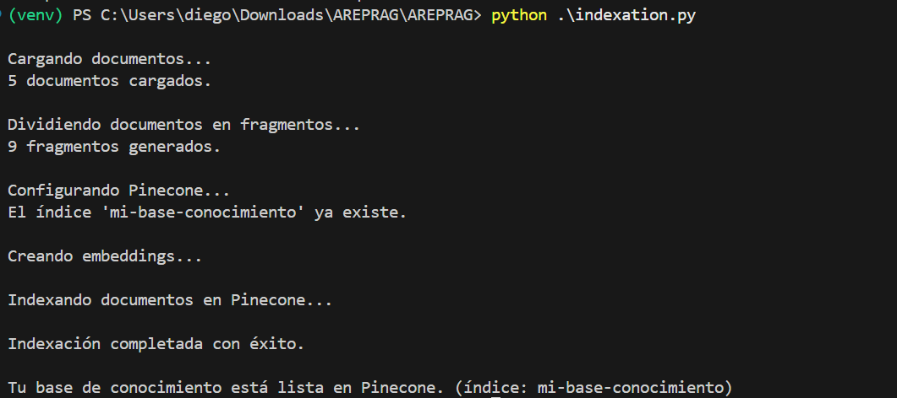
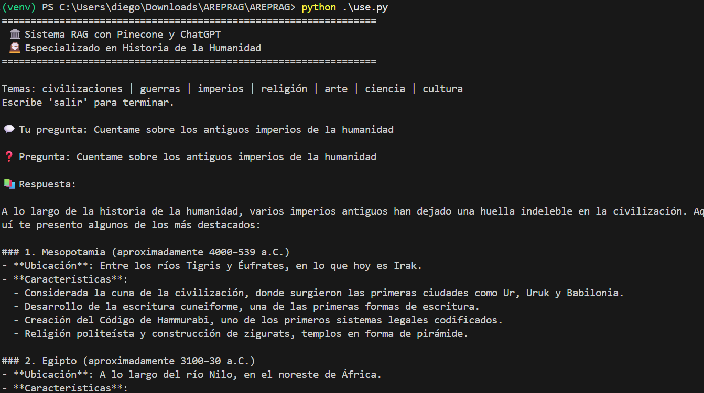
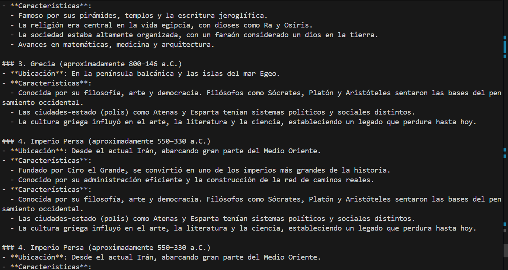

# RAG  sobre Historia de la Humanidad

Este proyecto implementa un sistema de Recuperación Aumentada por Generación (RAG) diseñado para realizar consultas inteligentes sobre la historia de la humanidad.
Combina el poder de Pinecone como base de datos vectorial y los modelos de OpenAI para ofrecer respuestas precisas y contextuales a partir del conocimiento almacenado.

## Características

- Búsqueda semántica de información histórica
- Respuestas generadas por IA basadas en contexto relevante
- Almacenamiento de vectores para búsquedas eficientes
- Interfaz de línea de comandos interactiva
- Especializado en temas históricos: civilizaciones, guerras, imperios, religión, arte, ciencia y cultura

## Requisitos

Antes de comenzar, asegúrate de tener instalado:

- Python 3.9
- [Pip](https://pip.pypa.io/en/stable/) (gestor de paquetes de Python)
- Una API Key de [OpenAI](https://platform.openai.com/)
- Una API Key de [Pinecone](https://www.pinecone.io/) para el almacenamiento vectorial

## Instalacion

1. Clona el siguiente repositorio:

   ```bash
   git clone https://github.com/thesrcielos/ArepRAG
   cd ArepRAG
   ```

2. Crear y acceder a un entorno virtual:

   ```bash
   python -m venv venv
   # En Windows:
   .\venv\Scripts\activate
   # En macOS/Linux:
   source venv/bin/activate
   ```

3. Instalacion de las dependencias:

   ```bash
   pip install -r requirements.txt
   ```

4. Crea un archivo .env en la raíz del proyecto con lo siguiente:

```
PINECONE_API_KEY=api_key
OPENAI_API_KEY=api_key
```

## Ejecución

### 1. Cargar datos a Pinecone

Asegúrate de tener un archivo `data/documentos.json` en el proyecto con los datos históricos. Luego ejecuta:

```bash
python indexation.py
```

Este script creará un índice en Pinecone llamado `mi-base-conocimiento` y cargará los datos históricos, dividiéndolos en fragmentos para una búsqueda más eficiente.

### 2. Ejecutar el sistema RAG

Para iniciar el sistema de preguntas y respuestas:

```bash
python use.py
```

Una vez iniciado, podrás hacer preguntas sobre historia de la humanidad y el sistema buscará en la base de conocimiento para darte respuestas precisas basadas en los documentos indexados.

**Ejemplos de preguntas:**
- "¿Cuáles fueron las principales civilizaciones antiguas?"
- "Explícame sobre la Revolución Industrial"
- "¿Qué fueron las Cruzadas?"

Escribe `salir`, `exit` o `quit` para terminar la sesión.

## 🛠️ Estructura del proyecto

- `indexation.py`: Script para cargar y indexar documentos históricos en Pinecone
- `use.py`: Script principal que implementa la lógica del sistema RAG con agente conversacional
- `data/documentos.json`: Archivo de datos con información sobre historia de la humanidad
- `requirements.txt`: Dependencias del proyecto
- `.env`: Archivo para variables de entorno (no incluido en el repositorio)
- `assets/`: Carpeta con imágenes de evidencia del proyecto

## Evidencia
Carga de datos a Pipecone

Pregunta al chat con RAG



